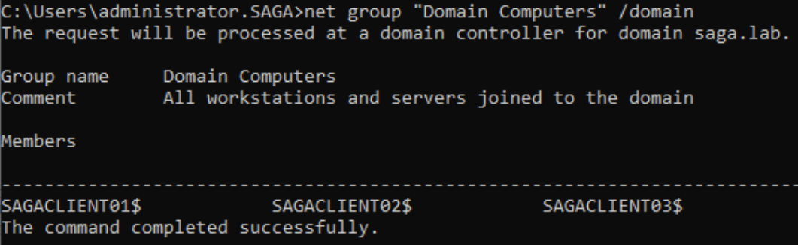
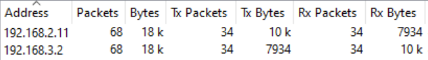
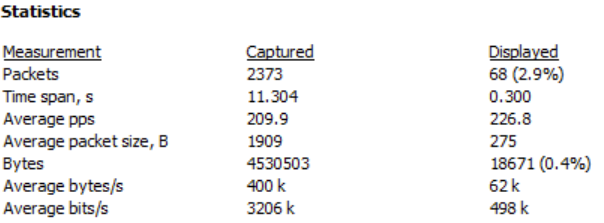
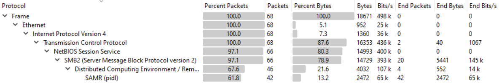

# T1018 - Remote System Discovery
This is a test filler.
|||
|-|-|
|**Mitre Att&ck Tactic**|T1018 Discovery|

## T1018-1 Remote System Discovery Using NET VIEW
|||
|-|-|
|**Test ID**|T1018-1|
|**Testable Client Platforms**|Windows Server 2000, 2003, 2008, 2008 R2, 2012, 2016 Windows XP, Vista, 7, 8|
|**Required Tools**|S0039 "NET" (native to windows)|
|**Last Updated**|2022-08-08|

Using the native net.exe we detect which domains and computers the client computer is associated with.
This test can also be performed on newer versions of windows, however it requires substantial configuration changes, which no **sane** user should ever perform.

### Prerequisities
For the command to execute successfully the following must all be TRUE:
- The "Function Discovery Provider Host" service is running on the client.
- The "Computer Browser" service is running on the client.
- The client is Domain Joined.
- The client is logged in as a regular user.

### Test Procedure
1. Open command prompt as a regular user.
2. Enter the command "net view" and hit enter.
3. If the terminal prints out a list of domains, computers and or resources shared by the client, the test has been completed successfully.

### Network Traffic
During initial testing, network traffic was not immediately determinable from packet captures.

### Resources
Microsoft Documentation for the Net view command: 
https://docs.microsoft.com/en-us/previous-versions/windows/it-pro/windows-server-2012-r2-and-2012/hh875576(v=ws.11) 

## T1018-2 Remote System Discovery Using NET GROUP
|||
|-|-|
|**Test ID**|T1018-2|
|**Testable Client Platforms**|Windows Server 2000, 2003, 2008, 2008 R2, 2012, 2016 Windows XP, Vista, 7, 8, 10, 11|
|**Required Tools**|S0039 "NET" (native to windows)|
|**Last Updated**|2022-08-08|

Using the native net.exe we detect which domains and computers the client computer is associated with.

### Prerequisities
For the command to execute successfully the following must all be TRUE:
- The client is Domain Joined.
- The client is logged in as a regular user.

### Test Procedure
1. Open command prompt as a regular user.
2. Enter the command "net group “Domain Computers” /domain" and hit enter.
3. If the terminal prints out a list of domains, computers and or resources shared by the client, the test has been completed successfully.

### Network Traffic
During initial testing, network traffic appeared to show a spike in SMB2, DCERPC and SAMR protocol traffic, all of which was sent between the Client and the Domain Controller.

The traffic contains requests from the client and responses from the domain controller using SMB2 and then binds to it using DCERPC.
From there the client enumeartes first the domains and then the domain group "Domain Computers" using the SAMR protocol. Once the enumeration has been completed, each connection is closed in turn.

### Resources
Microsoft Documentation for the NET GROUP command: 
https://docs.microsoft.com/en-us/previous-versions/windows/it-pro/windows-server-2012-r2-and-2012/cc754051(v=ws.11) 