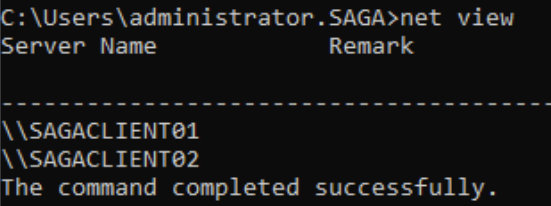

## T1018-1 Remote System Discovery Using NET VIEW
|||
|-|-|
|**Test ID**|T1018-1|
|**Testable Client Platforms**|Windows Server 2000, 2003, 2008, 2008 R2, 2012, 2016 Windows XP, Vista, 7, 8|
|**Required Tools**|S0039 "NET" (native to windows)|
|**Target**|Client|
|**Last Updated**|2022-08-08|

Using the native net.exe we detect which domains and computers the client computer is associated with.
This test can also be performed on newer versions of windows, however it requires substantial configuration changes, which no regular user should ever perform.

### Prerequisities
For the command to execute successfully the following must all be TRUE:
- The "Function Discovery Provider Host" service is running on the client.
- The "Computer Browser" service is running on the client.
- The client is Domain Joined.
- The client is logged in as a regular user.

### Test Procedure
1. Open command prompt as a regular user.
2. Enter the command "net view" and hit enter.
3. If the terminal prints out a list of domains, computers and or resources shared by the client, the test has been completed successfully.

### Network Traffic
During initial testing, network traffic was not immediately determinable from packet captures.

### Resources
Microsoft Documentation for the Net view command: 
https://docs.microsoft.com/en-us/previous-versions/windows/it-pro/windows-server-2012-r2-and-2012/hh875576(v=ws.11) 