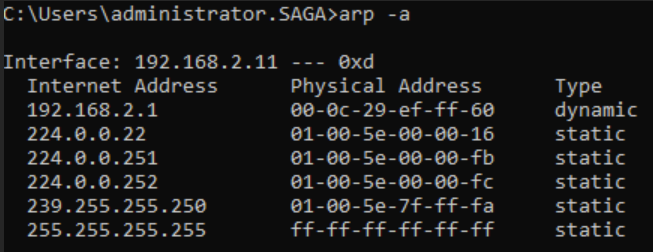

## T1018-3 Remote System Discovery Using ARP
|||
|-|-|
|**Test ID**|T1018-3|
|**Testable Client Platforms**|Windows Server 2008, 2008 R2, 2012, 2016 Windows 7, 8, 10, 11|
|**Required Tools**|"ARP" (native to windows)|
|**Target**|Client|
|**Last Updated**|2022-08-08|

Using the native arp.exe we detect which machines the client has stored in its ARP table.

### Test Procedure
|Prerequisites|
|-|
|The client must be logged in as a regular user.|
|The client must be connected to a network OR the client have been connected to a network and have generated an ARP table.|

|#|Instruction|
|-|-|
|1|Open command prompt as a regular user.|
|2|Enter the command "arp -a" and hit enter.|
|3|If the terminal prints out a list of physical addresses and associated IP addresses, the test is completed successfully.|

### Network Traffic
During initial testing, no network traffic was detected during command execution. 

### Resources
Microsoft Documentation for the ARP command: 
https://docs.microsoft.com/en-us/previous-versions/windows/it-pro/windows-server-2012-r2-and-2012/cc754761(v=ws.11) 