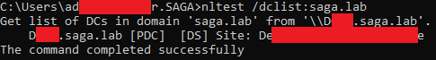

## T1018-3 Remote System Discovery NLTEST
|||
|-|-|
|**Test ID**|T1018-3|
|**Testable Client Platforms**|Windows Server 2003 SP1, 2003 R2, 2008, 2008 R2, 2012 Windows 8, 10, 11|
|**Required Tools**|[S0359](https://attack.mitre.org/software/S0359/) ["NLTEST" (native to windows or downloadable via RSAT)](https://docs.microsoft.com/en-us/previous-versions/windows/it-pro/windows-server-2012-r2-and-2012/cc731935(v=ws.11))|
|**Target**|Remote Targets|
|**Last Updated**|2022-08-10|

Using the native nltest command we can obtain information about the domain, such as a list of domain controllers.

### Test Procedure
|Prerequisites|
|-|
|The client must be logged in as a regular Domain user.|
|The client must be Domain joined.|
|The client must have [Remote Server Administration Tools (RSAT)](https://www.microsoft.com/en-us/download/details.aspx?id=45520) installed.|

|Variable Name|Variable Description|Example|
|-|-|-|
|**target_domain**|The domain to be queried via nltest|*saga.lab*|

|#|Instruction|Expected Outcome|Image|
|-|-|-|-|
|1|Open command prompt as a regular user.|||
|2|Enter the command "nltest.exe /dclist:#{target_domain}", hit enter, and wait for the results.|A list of domain trusts is printed in command prompt.||
|3|If the terminal prints out a list of domain controllers, the test is completed successfully.|||

### Network Traffic
During testing using one domain controller and one windows 10 host interconnected via a pfsense, network traffic during command execution showed a small spike in TCP packet traffic, 61% of which was DCERPC.  
 
The traffic appears to only involve the client machine and the domain controller. 
 
Almost at the very end, a DRSUAPI packet series is used to get the actual answers for the identities of the domain controllers using a DsGetDomainControllerInfo request/response. After which the connection is unbound and later disconnected. 

### Resources
[Microsoft Documentation for the nltest command](https://docs.microsoft.com/en-us/previous-versions/windows/it-pro/windows-server-2012-r2-and-2012/cc731935(v=ws.11)) 
[Microsoft Download Page for Remote Server Administration Tools (RSAT)](https://www.microsoft.com/en-us/download/details.aspx?id=45520)