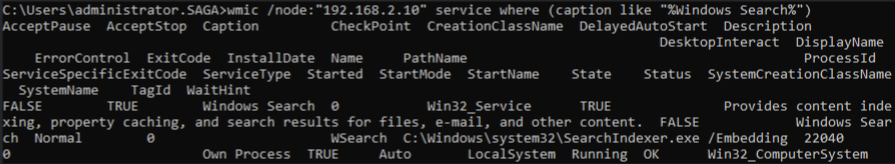

# T1047 - Windows Management Instrumentation
|||
|-|-|
|**Mitre Att&ck Tactic**|T1047 Execution|

## T1047-4 Recon/Enum Services on Remote Host
|||
|-|-|
|**Test ID**|T1047-4|
|**Testable Client Platforms**|Windows Server 2003, 2008, 2008 R2, 2012 Windows 7, 8, 10, 11|
|**Required Tools**|"WMIC" (Native to Windows)|
|**Target**|Remote Windows Host|
|**Last Updated**|2022-08-08|

Using the WMI (Windows Management Instrumentation) command line tool WMIC. We can query remote PC's for services running on that host.

### Prerequisities
For the command to execute successfully the following must all be TRUE:
- The client has a network connection to the remote target.
- The user signed into has permissions to see running services on the remote target.
- The client is logged in as a regular Domain user OR The client is logged in as a regular user which also exists on the remote target.

### Variables
|Variable Name|Variable Description|Example|
|-|-|-|
|**node**|IP address of the remote target.|*192.168.2.10*|
|**service_search_string**|Search string for the service description.|*Windows Search*|

### Test Procedure
1. Open command prompt as a regular user.
2. Enter the command “wmic /node:"#{node}" service where (caption like "%#{service_search_string}%")”, inserting the correct variables and hit enter. 
3. If the terminal prints out a list of domains, computers and or resources shared by the client, the test has been completed successfully.

### Network Traffic
During initial testing, network traffic was not immediately determinable from packet captures.

### Resources
Microsoft Documentation for the query command: https://docs.microsoft.com/en-us/previous-versions/windows/it-pro/windows-server-2012-r2-and-2012/cc788125(v=ws.11) 