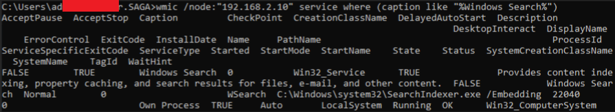

## T1047-4 Recon/Enum Services on Remote Host
|||
|-|-|
|**Test ID**|T1047-4|
|**Testable Client Platforms**|Windows Server 2003, 2008, 2008 R2, 2012 Windows 7, 8, 10, 11|
|**Required Tools**|["WMIC" (Native to Windows)](https://docs.microsoft.com/en-us/previous-versions/windows/it-pro/windows-server-2012-r2-and-2012/cc788125(v=ws.11))|
|**Target**|Remote Windows Host|
|**Last Updated**|2022-08-08|

Using the WMI (Windows Management Instrumentation) command line tool WMIC. We can query remote PC's for services running on that host.

### Test Procedure
|Prerequisites|
|-|
|The client has a network connection to the remote target.|
|The user signed into has permissions to see running services on the remote target.|
|The client is logged in as a regular Domain user OR The client is logged in as a regular user which also exists on the remote target.|

|Variable Name|Variable Description|Example|
|-|-|-|
|**node**|IP address of the remote target.|*192.168.2.10*|
|**service_search_string**|Search string for the service description.|*Windows Search*|

|#|Instruction|
|-|-|
|1|Open command prompt as a regular user.|
|2|Enter the command “wmic /node:"#{node}" service where (caption like "%#{service_search_string}%")”, inserting the correct variables and hit enter.|
|3|If the terminal prints out a list of domains, computers and or resources shared by the client, the test has been completed successfully.|

### Network Traffic
The test was performed using a windows 10 virtual machine as client and another as the remote target. Both were domain joined through another VM and networked using a PFSense VM. All of which was part of Saga Labs.

During testing network traffic showed a spike in network traffic between the client and target, with some traffic between the client and domain controller. The spike contains a segment of network traffic showing DCERPC, ISystemActivator and IRemUnknown2 packets.  

The initial connection shows a bind between the client and the target until a DCERPC packet is sent to the remote host stating AUTH3: call_id and another stating Request: call_id. The response appears to be a TCP ACK packet from the target to the client, and followed by the target verifying the auth information using RPC_NETLOGON protocol. 

Following the response from this RPC_NETLOGON verification, the client and target communicate using TCP, DCERPC and IRemUnknown2 for less than half a second after which the connection is terminated. 

### Resources
Microsoft Documentation for the query command: https://docs.microsoft.com/en-us/previous-versions/windows/it-pro/windows-server-2012-r2-and-2012/cc788125(v=ws.11) 