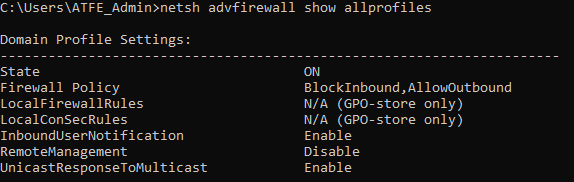

## T1518.001-1 - Security Software Discovery using netsh and tasklist
|||
|-|-|
|**Test ID**|T1518.001-1|
|**Testable Client Platforms**|Windows Server 2003, 2008, 2008 R2, 2012 Windows XP, Vista, 7, 8, 10, 11|#EDIT THIS!!!!!!!
|**Required Tools**|[S0057](https://attack.mitre.org/software/S0057/) ["TASKLIST" (Native to Windows)]() [S0108](https://attack.mitre.org/software/S0108/) ["NETSH" (Native to Windows)]()|
|**Target**|Client|
|**Last Updated**|2022-08-09|

Using netsh and tasklist we can identify installed and running software which could be any type of security software like anti-virus or malware detection.

### Test Procedure
|Prerequisites|
|-|
|The client is logged in as a regular user.|

|#|Instruction|Expected Unprotected Outcome|Image Example|
|-|-|-|-|
|1|Open command prompt as a regular user.|Command prompts opens as regular user.||
|2|Enter the command "netsh advfirewall show allprofiles” and hit enter.|Information about private and domain firewall settings should print out in commandprompt.||
|3|If the terminal prints out a list of information detailing the install langauge region and ID and the InstallLanguageFallback ID's, the test has been completed successfully.|||

### Network Traffic
During testing, no network traffic was identified which could be attributed to the test.

### Resources
[Microsoft Documentation for the reg query command](https://docs.microsoft.com/en-us/previous-versions/windows/it-pro/windows-server-2012-r2-and-2012/cc742028(v=ws.11))